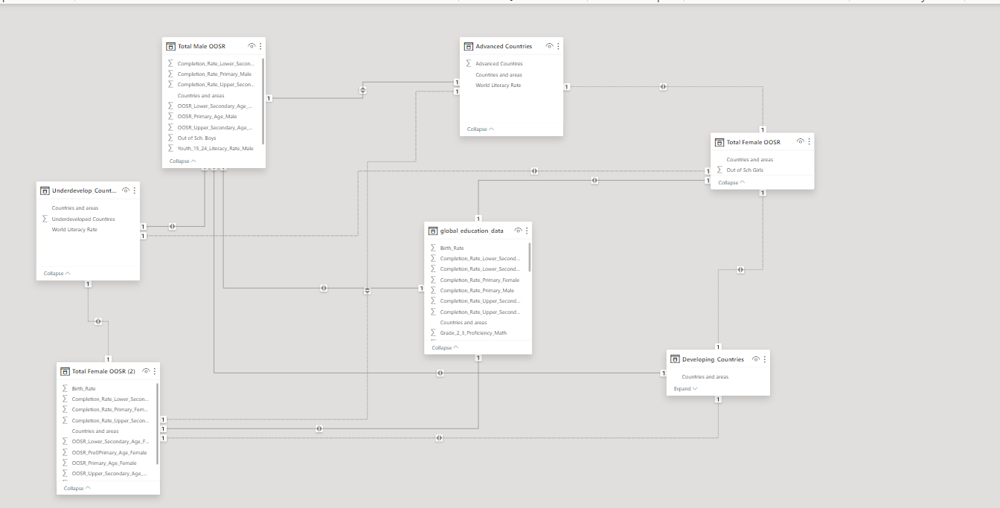
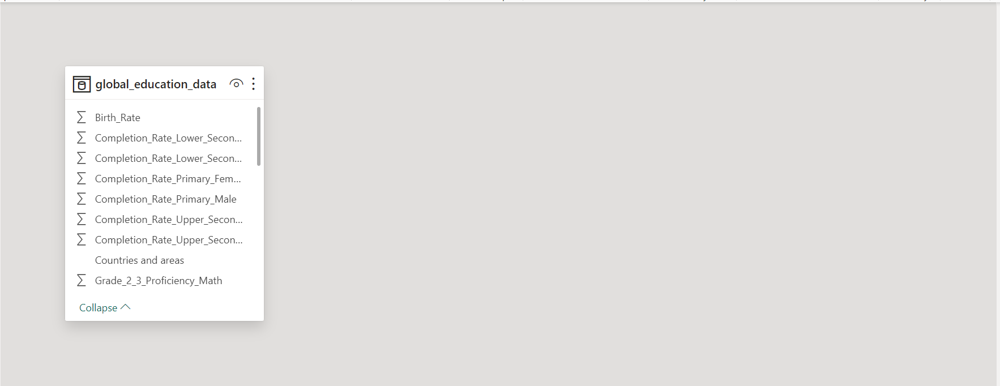
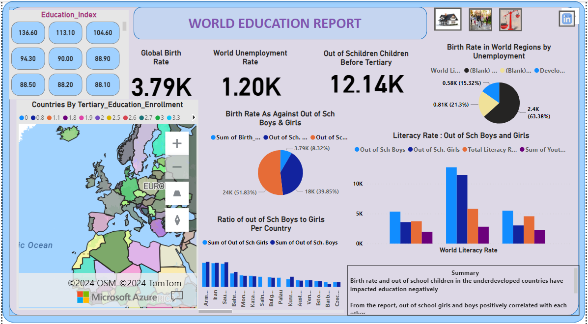
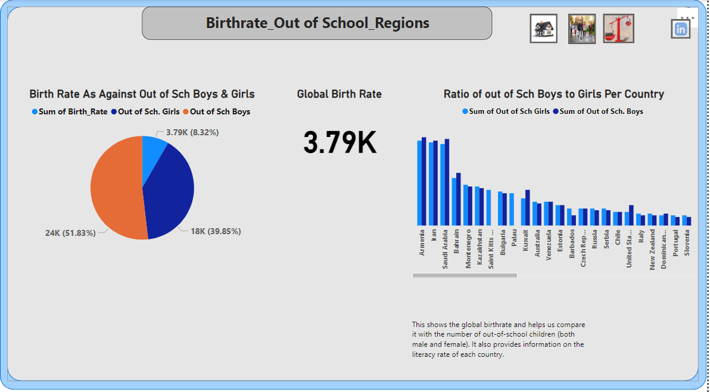

# World-Education

## Introduction:
Welcome to a 3-page dashboard, where I delve into key metrics shaping the educational landscape worldwide. Here, I illuminate pivotal factors such as birth rates, school enrollment rates, out-of-school rates, literacy rates, and unemployment rates across various countries.
Embark on your exploration by engaging with the:
"Education_Index" button, your gateway to comprehensive insights into birth rates, school enrollment, out-of-school populations, and unemployment rates. This feature serves as your compass, guiding you through the intricate web of data and revealing nuanced relationships between countries and these vital indicators.
Navigate through the data-rich canvas, observe the intricate flow of information delineating the interconnectedness of birth rates, literacy rates, and the prevalence of out-of-school children. Through this lens, you will discern patterns, trends, and disparities, laying the groundwork for informed recommendations.
Seeking to mitigate the plight of out-of-school children? This dashboard empowers you to propose actionable solutions by leveraging the wealth of data at your disposal. Whether advocating for targeted interventions, policy reforms, or community-based initiatives, your recommendations hold the potential to affect meaningful change and foster inclusive education systems worldwide.
___

## Problem statement:
The global educational landscape is influenced by a multitude of factors, including birth rates, school enrollment rates, out-of-school populations, literacy rates, and unemployment rates. Despite efforts to address these challenges, disparities persist across various countries, impacting the access and quality of education for millions of children worldwide. Investigate the data and show a flow of information indicating the relationship of countries to birth rate, literacy rate, out of school children, and recommend a way on how to reduce the out of school children.
___

## Data Sourcing:
The dataset comprises a single table, the Global Education Table, which consists of one sheet containing 29 columns and 203 rows.
___

## Skill/ Concept demonstrated:

The following power BI features were used in the visualization:
-	Download data,
-	Transformation,
-	DAX, Quick measure,
-	Page navigation, 
-	Modelling,
-	Power query,
-	Azure map visual,
-	Padding,
-	On hovering,
-	Filter.
___

## Modelling:

Automatic derived relationship was adjusted to remove unwanted relationship.

 Adjusted model                |  Auto model
 :---------------------------: |  :---------------------:
| 

The model is a star schema. There are 7-dimension tables and one fact table that create a one-to-many relationship.

___

## Visualization and Analysis:

This is a 3-page dashboard and it is called a report. It explains the birth rate, school enrollment rate, out of school rate, literacy rate, and unemployment rate of countries of the world.
1. The Education_Index button provides a comprehensive explanation of birth rates, school enrollment, out-of-school populations, and unemployment rates. It enables users to investigate the data and discern the interrelationships between countries based on birth rate, literacy rate, and the prevalence of out-of-school children, ultimately guiding recommendations to reduce the number of out-of-school children.
2. These buttons possess exceptional uniqueness, with each elucidating various attributes of a country based on the provided data visualization.
3. The first three icons located on the upper right side of the dashboard facilitate seamless navigation between different pages of the report. Meanwhile, the last icon directs users to my LinkedIn profile for enhanced viewing.
___

### Analysis

This provides an overview of birth rates, out-of-school populations, and regional distributions. It further incorporates unemployment and literacy rates, rendering the dashboard self-explanatory
___

### Birthrate, Out of School, Region

From this report, although the birth rate is __51.83%__, the majority of the __39.85%__ pertains to out-of-school girls. It is evident that girls leave school prematurely due to early pregnancy or the cultural preference for male children over them. Additionally, the report illustrates the ratio of out-of-school boys to girls in each country.
___

### Birthrate, Unemployment, Literacy

Here is a visual representation of each country and its literacy rates for both boys and girls, utilizing the education index.
Unemployment has also significantly affected underdeveloped countries, exacerbated by higher birth rates and early school dropout rates, leading to elevated unemployment figures in these regions. This has resulted in an unemployment rate of __63.38%__.

You can interact with the report [HERE](https://app.powerbi.com/groups/me/reports/0496c336-abb6-4cd7-971e-ea5b81264e88/ReportSection685b40e26c814e52f52f?experience=power-bi) 😄
___

## Recommendations:
Birth rate and out of school children in the underdeveloped countries have impacted education negatively
Literacy rate has also been impacted negatively leaving a few to for further advanced their studies.
From the report, out of school girls and boys positively correlated with each other. This is evident in countries of higher birthrate where source of livelihood is limited.
Survival and source of livelihood causes low level of tertiary education enrollment.
We will recommend that there should be a global campaign of education for all from elementary to advance level of study.
There should also be sensitization on child birth control because it is evident that developing countries __3.79K__ and they housed majority of the out of school children before tertiary education which bring the global total to __12.14K__.
Most importantly, the government should the needful by providing job opportunities for the citizens
1.	The impact of high birth rates and the prevalence of out-of-school children in underdeveloped countries has significantly hampered educational progress.
2.	The low literacy rates in these regions further exacerbate the situation, limiting opportunities for individuals to pursue advanced studies.
3.	Our analysis indicates a positive correlation between the number of out-of-school girls and boys, particularly pronounced in countries with higher birth rates and limited economic opportunities.
4.	The struggle for survival and lack of viable livelihoods contribute to low tertiary education enrollment rates in these regions.
5.	We advocate for a comprehensive global campaign promoting universal education, spanning from elementary to advanced levels, to address these challenges effectively.
6.	Additionally, there is a pressing need for heightened awareness and education regarding family planning and birth control measures, especially in developing countries where the majority of out-of-school children reside. This proactive approach can help alleviate the strain on educational resources, with the global total of out-of-school children currently estimated at __12.14K__.
7.	Most importantly, governments must prioritize the creation of job opportunities to address the root causes of educational disparities and provide sustainable pathways for socio-economic development.

Thank you for going through my report.🤝

